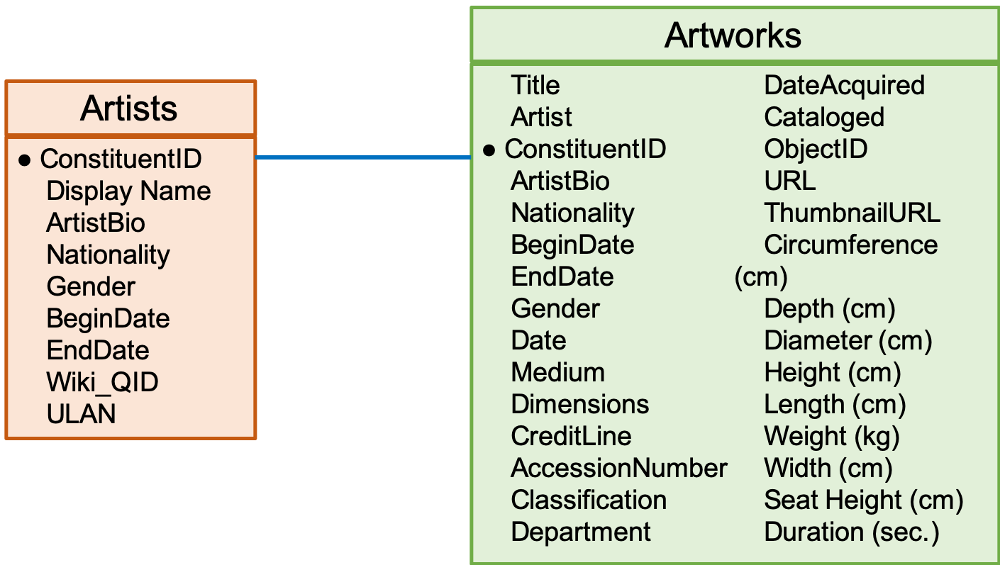

# Final Project: Programming for Data Science 2019

[PosgtreSQL]: <https://www.postgresql.org/>
[Python 3.7.3]: <https://www.python.org/downloads/release/python-373/>
[MoMa]: <https://github.com/MuseumofModernArt/collection>

This project provides a structured workflow for loading and analyzing the The Museum of Modern Art ([MoMA]) research dataset  [](https://doi.org/10.5281/zenodo.3524700) using [PosgtreSQL] and [Python 3.7.3]. This is part of the final project of Programming for Data Science fall-2019. 

#### Contact Information

  - Alejandra Lelo de Larrea Ibarra  - - 124433 - - alelli3@hotmail.com
  - Itzel Zayil Muñoz Fernández de Córdova - - 122803 - - izmfc17@gmail.com
  - René Rosado González - - 137085 - - renerosadogonzalez@gmail.com

#### About the project

This project uses The Museum of Modern Art ([MoMA]) research dataset 
[](https://doi.org/10.5281/zenodo.3524700) in order to put into practice the knowledge acquired in the *Programming for Data Science* class. The following sections will discuss each step in the workflow and how to execute the code. 
> This research dataset contains 138,124 records, representing all of the works that have been accessioned into MoMA’s collection and cataloged in our database. 

Given the nature of the data, **we aim to predict if an alive artist will entered an artwork during the next year**. This ML problem will be assessed using bash, SQL and Python to download, clean and process the [MoMA] database. It is worth mentioning that the scope of the project does not include the estimation of the ML algorithms to solve the above mentioned problem and will only cover up to the creation of features. The following sections will explain in more detail each step of the workflow and our lines of thought.

#### Workflow

This project's workflow covers from the creation of a virtual environment to the creation of a table of features to be used as inputs in further ML algorithms. 

The sh directory in the repo, contains **.sh** files that execute the complete workflow as follows:

  - Downloading MoMA files -- *download_moma_data.sh*
  - Creating PostgreSQL user and database -- *create_user_db_moma.sh*
  - Process the database -- *process_data.sh* through:
      - creating schemas,
      - creating raw tables,
      - loading data, 
      - cleaning the database, 
      - creating the semantic schema (with entities and events),
      - creating the cohorts and labels
      - creating the features

After creating the **moma** python envionment, all the .sh files can be executed with the pipeline.sh file. Therefore, to execute the complete workflow and be able to reproduce our project, you need to follow these steps:

1. Set up a **NEW** virtual machine using vagrant.
2. Change to root directory:
```text
cd ~
```
3. Clone this git repository: 
```text
git clone https://github.com/AlejandraLLI/pds-2019.git
```
4. Create the moma environment: 
 ```text
pyenv virtualenv 3.7.3 moma
 ```
5. Change to the repo directory:
```text
cd pds-2019
```
6. Assign the moma environment to the pds-2019 directory 
```text
echo moma > .python-version
```
7. Install poetry 
```text
pip install poetry
```
8. Install dependencies from the pyproject.toml file. 
```text
poetry install
```
Note: During the development of this project we experimented some problems installing the python packages with poetry install. After the previous step, please check that packages were properly installed verifying the available modules in the moma.py. To do this, please run the following: 
```text
cd moma
pytho moma.py
```
The output should look like this: 
```text 
Usage: moma.py [OPTIONS] COMMAND [ARGS]...

  Create the connection to the moma database in postgres using the given
  default configuration. :param module ctx: subclass of the dict object.
  :return:  :rtype:

Options:
  --help  Show this message and exit.

Commands:
  create-cohorts     Execute the SQL commands to create the cohort tables...
  create-features    Execute the SQL commands to create tables of new...
  create-labels      Execute the SQL commands to create tables in the
                     labels...
  create-raw-tables  Execute the SQL commands to create tables in the raw...
  create-schemas     Execute the SQL commands to create the schemas raw,...
  load-moma          Execute the SQL commands to load the moma data in the...
  to-cleaned         Execute the SQL commands to pass tables from raw
                     schema...
  to-semantic        Execute the SQL commands to pass tables from cleaned...
``

. Give execution permission to the pipeline.sh file:
```text
chmod +x ./sh/pipeline.sh
```
If the output is not like the previously showed or if you get an error message please try again with the command ***poetry install*** until it's properly installed in the vm. 

9. Go back to pds-2019
```text
cd ..
```

10. Execute the pipeline.sh file:
```text
./sh/pipeline.sh
```

After completing these steps, you can enter to Postgresql and confirm all the schemas and tables where created using this commands:
```text
psql -h 0.0.0.0 -U moma -d moma -W
```
The default name of the database is ***"moma"*** and the default user is ***"moma"*** with password ***"pds_moma"***. Note that the user and password are being revealed here only for academic purposes, but in general IT'S NOT recommended to post this type of information in Github repositories. If you want to create a different user and/or assign a different password, you need to edit the *create_user_db_moma.sh* file as well as the *settings.toml* file in the *config* directory.

In the further sections, we describe all details in each step of the workflow previously described, and show how postgreSQL queries should look like. 


##### Python project structure
Our repo contains the recommended directory structure for Python projects. Most of the directories contain a en empty file named *fake_file.txt* in order for git to be able to track those directories, please ignore them. 


##### Creating the virtual environment and installing the python packages

We created a virtual environment in Python named "moma" for the project. This environment contains the following packages: 
*click*, *dynaconf*, *psycopg2*, *flake8*, *black*, *mypy*, *sphinx* among others. All this info is contained in the *pypoject.toml* file and are installed through poetry. 

This step of the workflow can be run with steps 4-8 of the instructions above. 

##### Downloading MoMa
> The database includes basic meta-data for each work, including title, artist, date made, medium, dimensions, and date acquired by the Museum. Some of these records have incomplete information and are noted as “not Curator Approved.”  ([MoMa])

The database has two tables that are available in both csv and json files. Figure \ref{entity_rel_diagram} shows the entity-relation diagram for this tables. 



For practicality we use the csv files in the project which and have the following columns:

###### Artists
+ ConstituentID -- artist's ID
+ DisplayName -- artist's name
+ ArtistBio -- short artist's biography
+ Nationality -- artist's nationality
+ Gender -- artist's gender
+ BeginDate -- artist's birth year
+ EndDate -- artist's death year
+ Wiki QID -- artist's ID in Wikidata
+ ULAN -- artist's ID in *"Union List of Artist Names"*

###### Artworks
+ Title -- artwork's title
+ Artist -- artist's name or artists' names that created the artwork
+ ConstituentID -- artist's or artists' ID that created the artwork
+ ArtistBio -- short artist's biography
+ Nationality -- artist's nationality
+ BeginDate -- artist's birth year
+ EndDate -- artist's death year
+ Gender -- artist's gender
+ Date -- year when the artwork was created
+ Medium -- materials the artwork is made from
+ Dimensions -- artwork's height and width (in inches and cm)
+ CreditLine -- artwork's credit line
+ AccessionNumber -- the first number indicates the order when the artwork was acquired in the respective year, the second number is the year the artwork was acquired, the third number (when it exists) indicates the piece number of the artwork
+ Classification -- type of artwork
+ Department -- artwork's department
+ DateAcquired -- year when MoMA acquired the artwork
+ Cataloged -- whether the artwork is cataloged or not
+ ObjectID -- artwork's ID
+ URL -- artwork's URL in MoMA's web page
+ ThumbnailURL -- artwork's thumb nail url in MoMA's web page
+ Circumference (cm) -- artwork's circumference in cm (if applies)
+ Depth (cm) -- artwork's depth in cm (if applies)
+ Diameter (cm) -- artwork's diameter in cm (if applies)
+ Height (cm) -- artwork's height in cm (if applies)
+ Length (cm) -- artwork's length in cm (if applies)
+ Weight (kg) -- artwork's weight in cm (if applies)
+ Width (cm) -- artwork's width in cm (if applies)
+ Seat Height (cm) -- artwork's seat height in cm (if applies)
+ Duration (sec.) -- artwork's duration in seconds (if applies)
 
This step of the workflow can be run independently with the *download_moma_data.sh* file in the *sh* directory. 


##### Creating PostgreSQL user and database

The project requires the creation of a database and a user in order to process the MoMA database. As previously explained, the default name of the database is ***"moma"*** and the default user is ***"moma"*** with password ***"pds_moma"***. 

Once you have run the pipeline, you can enter to PostgreSQL and confirm that the database and user were properly created with the following commands:
To connect to the database
```text
psql -h 0.0.0.0 -U moma -d moma -W
````
To check all available databases use
```text
\l
````
The output should be similar to 
```text
                                  List of databases
   Name    │  Owner   │ Encoding │   Collate   │    Ctype    │   Access privileges   
═══════════╪══════════╪══════════╪═════════════╪═════════════╪═══════════════════════
 moma      │ moma     │ UTF8     │ en_US.UTF-8 │ en_US.UTF-8 │ 
 postgres  │ postgres │ LATIN1   │ en_US       │ en_US       │ 
 template0 │ postgres │ LATIN1   │ en_US       │ en_US       │ =c/postgres          ↵
           │          │          │             │             │ postgres=CTc/postgres
 template1 │ postgres │ LATIN1   │ en_US       │ en_US       │ =c/postgres          ↵
           │          │          │             │             │ postgres=CTc/postgres
(4 rows)
```
To check all available users use
```text
\du
```
The output should be similar to

```text
                                   List of roles
 Role name │                         Attributes                         │ Member of 
═══════════╪════════════════════════════════════════════════════════════╪═══════════
 moma      │                                                            │ {}
 postgres  │ Superuser, Create role, Create DB, Replication, Bypass RLS │ {}
 ````

This step of the workflow can be run independently with the *create_user_db_moma.sh* file in the *sh* directory. 

##### Processing the data 

To process data, we automatized the sql queries through the *moma.py* file. This file has 8 modules that help to create the different schemas and tables in PostgreSQL. These modules are: 
1. create-schemas
2. create-raw-tables
3. load-moma
4. to-cleaned
5. to-semantic
6. create-cohorts
7. create-labels
8. create-features 

This steps can be run independently with the *processing_data.sh* file in the *sh* directory.  We now proceed to explain each of them. 

###### Creating Schemas

With the module ***create-schemas*** contained in the *moma.py* file, we create 6 different schemas for the project:
1. *raw*: to copy MoMA database "as it is". All variables are defined as text strings. 
2. *cleaned*: to clean data, using proper names for columns, separating info in columns (if needed), and assigning the correct type to each column. 
3. *semantic*: transform data into entities and events. 
4. *cohort*: define the as_of_date and entities available in the corresponding periods.
5. *labels*: create labels for the observations in the corresponding periods. 
6. *features*: create new features derived from entities and create features from the different type of aggregations of the characteristics of the events. 

You can verify the schemas created in the database with:
```text
\dn
```
The output should be similar to
```text
   List of schemas
   Name   │  Owner   
══════════╪══════════
 cleaned  │ moma
 cohorts  | moma
 features │ moma
 labels   | moma
 public   │ postgres
 raw      │ moma
 semantic │ moma
 (7 rows)
```

##### Creating Raw Tables

After creating the schemas, we proceed to create the tables in the raw schema. This schema contains all the variables described in the **Downloading MoMa** section exactly as they appear but setting each column type as text. Note that both csv files start with upper case, as well as the name of the variables. To follow the convention of "as it is" we leave this uppercases in the raw schema.

You can view the tables in this schema with:
```text
\dt raw.
```
And the output should be similar to:
```text
         List of relations
 Schema │   Name   │ Type  │ Owner 
════════╪══════════╪═══════╪═══════
 raw    │ artists  │ table │ moma
 raw    │ artworks │ table │ moma
(2 rows)
```
To get a more detailed description of the tables you can use: 
```text
\d raw.Artists
```
with the following output
```text
                  Table "raw.artists"
    Column     │ Type │ Collation │ Nullable │ Default 
═══════════════╪══════╪═══════════╪══════════╪═════════
 ConstituentID │ text │           │          │ 
 DisplayName   │ text │           │          │ 
 ArtistBio     │ text │           │          │ 
 Nationality   │ text │           │          │ 
 Gender        │ text │           │          │ 
 BeginDate     │ text │           │          │ 
 EndDate       │ text │           │          │ 
 Wiki QID      │ text │           │          │ 
 ULAN          │ text │           │          │ 
  ````
 and 
 
 ```text
 \d raw.artworks
 ````
with output equal to
```text
                    Table "raw.artworks"
       Column       │ Type │ Collation │ Nullable │ Default 
════════════════════╪══════╪═══════════╪══════════╪═════════
 Title              │ text │           │          │ 
 Artist             │ text │           │          │ 
 ConstituentID      │ text │           │          │ 
 ArtistBio          │ text │           │          │ 
 Nationality        │ text │           │          │ 
 BeginDate          │ text │           │          │ 
 EndDate            │ text │           │          │ 
 Gender             │ text │           │          │ 
 Date               │ text │           │          │ 
 Medium             │ text │           │          │ 
 Dimensions         │ text │           │          │ 
 CreditLine         │ text │           │          │ 
 AccessionNumber    │ text │           │          │ 
 Classification     │ text │           │          │ 
 Department         │ text │           │          │ 
 DateAcquired       │ text │           │          │ 
 Cataloged          │ text │           │          │ 
 ObjectID           │ text │           │          │ 
 URL                │ text │           │          │ 
 ThumbnailURL       │ text │           │          │ 
 Circumference (cm) │ text │           │          │ 
 Depth (cm)         │ text │           │          │ 
 Diameter (cm)      │ text │           │          │ 
 Height (cm)        │ text │           │          │ 
 Length (cm)        │ text │           │          │ 
 Weight (kg)        │ text │           │          │ 
 Width (cm)         │ text │           │          │ 
 Seat Height (cm)   │ text │           │          │ 
 Duration (sec.)    │ text │           │          │ 
````

##### Load MoMA

After loading MoMA, database, you can start querying the tables in the raw schema. For example, the total number of observations in each table can be consulted as follows: 
```text
select count(*) from raw.Artists;
```
with output similar to 
```text
 count 
═══════
 15790
(1 row)

Time: 2.091 ms
```
```text
select count(*) from raw.Artworks;
```
with output similar to 
```text
 count  
════════
 138025
(1 row)

Time: 32.495 ms
```
This is, there are 15,790 artists in the database and 138,025 artworks. 

##### To Cleaned

Once the data is loaded in the raw schema. We proceed to clean the data and fill tables in the cleaned schema. 

For the raw.Artists table we:
- Dropped columns with duplicate information, such as *Artistbio* (conformed of the nationality, birth and dead years). 
- Renamed columns to make more sens. 
- Assign the correct type of variable for each column.
- Convert strings to lower case for varchars to unify. For example in gender we found "Male" and "male" which are the same value. 

The cleaned data was stored in the cleaned.artists table. The following command prints the description of the table.
```text
\d cleaned.artists
```
and the output is
```text
                     Table "cleaned.artists"
   Column    │       Type        │ Collation │ Nullable │ Default 
═════════════╪═══════════════════╪═══════════╪══════════╪═════════
 artist      │ integer           │           │          │ 
 name        │ character varying │           │          │ 
 nationality │ character varying │           │          │ 
 gender      │ character varying │           │          │ 
 birth_year  │ double precision  │           │          │ 
 death_year  │ double precision  │           │          │ 
 wiki_qid    │ character varying │           │          │ 
 ulan        │ integer           │           │          │ 
Indexes:
    "cleaned_artists_artist_ix" btree (artist)
    "cleaned_artists_bith_year_ix" btree (birth_year)
    "cleaned_artists_death_year_ix" btree (death_year)
```
Note that we have also created indexes for the table to facilitate the queries. To actually see some cleaned data, you can use 
```text
select * from cleaned.artists limit 10;
````
with an output similar to: 
```text
  artist │      name       │ nationality │ gender │ birth_year │ death_year │ wiki_qid │   ulan    
════════╪═════════════════╪═════════════╪════════╪════════════╪════════════╪══════════╪═══════════
      1 │ robert arneson  │ american    │ male   │       1930 │       1992 │ ¤       │        ¤
      2 │ doroteo arnaiz  │ spanish     │ male   │       1936 │         ¤ │ ¤       │        ¤
      3 │ bill arnold     │ american    │ male   │       1941 │         ¤ │ ¤       │        ¤
      4 │ charles arnoldi │ american    │ male   │       1946 │         ¤ │ q1063584 │ 500027998
      5 │ per arnoldi     │ danish      │ male   │       1941 │         ¤ │ ¤       │        ¤
(5 rows)
```
For the raw.Artworks table we:
- Dropped columns with duplicate information in table cleaned.artists, such as *Artistbio*, *Nationality*, *Artist* (name), *BeginDate*, *EndDate*, *Gender*, *Dimensions* (repeated in with and height). 
- Renamed columns to make more sens. 
- Assign the correct type of variable for each column.
- Convert strings to lower case for varchars to unify. 

The cleaned data was stored in the cleaned.artworks table. The following command prints the description of the table.
```text
\d cleaned.artworks
```
and the output is
```text
                       Table "cleaned.artworks"
      Column      │       Type        │ Collation │ Nullable │ Default 
══════════════════╪═══════════════════╪═══════════╪══════════╪═════════
 artwork          │ integer           │           │          │ 
 title            │ character varying │           │          │ 
 artist_array     │ text[]            │           │          │ 
 year_made        │ double precision  │           │          │ 
 medium           │ character varying │           │          │ 
 credit_line      │ character varying │           │          │ 
 accession_number │ character varying │           │          │ 
 classification   │ character varying │           │          │ 
 department       │ character varying │           │          │ 
 date_acquired    │ date              │           │          │ 
 cataloged        │ character(1)      │           │          │ 
 url              │ character varying │           │          │ 
 thumbnailurl     │ character varying │           │          │ 
 circumference_cm │ numeric           │           │          │ 
 depth_cm         │ numeric           │           │          │ 
 diameter_cm      │ numeric           │           │          │ 
 heigth_cm        │ numeric           │           │          │ 
 length_cm        │ numeric           │           │          │ 
 weight_kg        │ numeric           │           │          │ 
 width_cm         │ numeric           │           │          │ 
 seat_height_cm   │ numeric           │           │          │ 
 duration_sec     │ numeric           │           │          │ 
Indexes:
    "cleaned_artworks_artist_array_ix" btree (artist_array)
    "cleaned_artworks_artwork_ix" btree (artwork)
    "cleaned_artworks_date_acquired_ix" btree (date_acquired)
    "cleaned_artworks_year_made_ix" btree (year_made)
```
Note that, similar to the artists table, we have created indexes to facilitate the queries. To actually see some cleaned data, you can use 
```text
select * from cleaned.artworks limit 5;
````
The output is not shown here because is too wide. 

##### To Semantic
As mentioned earlier, we want to predict if an alive artist will enter an artwork during the following year. To do this, and given the nature of the data, we define the artist as our entity and each entity can have two types of associated events: i) the artist entered an artwork to the MoMA, or ii) the artist dies. 

The static characteristics of the entity (artist) are saved in the *semantic.entities* table. We assume that an artist can't change either its gender nor its nationality, such that these are static characteristics. To check the structure of this table, use the following command:
```text
\d semantic.entities
```
It should show you an output similar to 
```text
                    Table "semantic.entities"
   Column    │       Type        │ Collation │ Nullable │ Default 
═════════════╪═══════════════════╪═══════════╪══════════╪═════════
 artist      │ integer           │           │          │ 
 name        │ character varying │           │          │ 
 nationality │ character varying │           │          │ 
 gender      │ character varying │           │          │ 
 birth_year  │ double precision  │           │          │ 
 wiki_qid    │ character varying │           │          │ 
 ulan        │ integer           │           │          │ 
Indexes:
    "entities_artist_ix" btree (artist)
    "entities_birth_year_ix" btree (birth_year)
    "entities_gender_ix" btree (gender)
    "entities_nationality_ix" btree (nationality)
````
And to actually see some observations use 
```text
select * from semantic.entities limit 5; 
````
which should have an output like
```text
 artist │      name       │ nationality │ gender │ birth_year │ wiki_qid │   ulan    
════════╪═════════════════╪═════════════╪════════╪════════════╪══════════╪═══════════
      1 │ robert arneson  │ american    │ male   │       1930 │ ¤       │        ¤
      2 │ doroteo arnaiz  │ spanish     │ male   │       1936 │ ¤       │        ¤
      3 │ bill arnold     │ american    │ male   │       1941 │ ¤       │        ¤
      4 │ charles arnoldi │ american    │ male   │       1946 │ q1063584 │ 500027998
      5 │ per arnoldi     │ danish      │ male   │       1941 │ ¤       │        ¤
(5 rows)
````


For the events, we will use two separated tables: 
1. *events_artworks_in*: contains the artworks that have entered the Moma and its static characteristics such as dimensions, title, artist(s), department, etc... An important thing to notice here is that, since one artwork could have more than one artist associated and this was stored in an arrray in the raw and cleaned schemas, the events_artworks_in table unnests this information such that each row corresponds to one artwork and one artist. This is, some artworks will appear in more than one observation. The structure of the table is as follows:
```text
 \d semantic.events_artworks_in
 
                  Table "semantic.events_artworks_in"
      Column      │       Type        │ Collation │ Nullable │ Default 
══════════════════╪═══════════════════╪═══════════╪══════════╪═════════
 artwork          │ integer           │           │          │ 
 date_acquired    │ date              │           │          │ 
 title            │ character varying │           │          │ 
 artist           │ integer           │           │          │ 
 year_made        │ double precision  │           │          │ 
 medium           │ character varying │           │          │ 
 credit_line      │ character varying │           │          │ 
 classification   │ character varying │           │          │ 
 department       │ character varying │           │          │ 
 cataloged        │ character(1)      │           │          │ 
 url              │ character varying │           │          │ 
 thumbnailurl     │ character varying │           │          │ 
 circumference_cm │ numeric           │           │          │ 
 depth_cm         │ numeric           │           │          │ 
 diameter_cm      │ numeric           │           │          │ 
 heigth_cm        │ numeric           │           │          │ 
 length_cm        │ numeric           │           │          │ 
 weight_kg        │ numeric           │           │          │ 
 width_cm         │ numeric           │           │          │ 
 seat_height_cm   │ numeric           │           │          │ 
 duration_sec     │ numeric           │           │          │ 
Indexes:
    "events_artworks_in_artist_ix" btree (artist)
    "events_artworks_in_artwork_ix" btree (artwork)
    "events_artworks_in_date_acquired_ix" btree (date_acquired)
    "events_artworks_in_year_made_ix" btree (year_made)
```
To view some observations use
```text
select * from semantic.events_artworks_in limit 5;
```
The output is not shown here because is too wide. 

2. *events_artists_deaths*: contains the artist and his/her year of death (if applies). The structure of the table is as follows:
```text
\d semantic.events_artists_deaths
             Table "semantic.events_artists_deaths"
   Column   │       Type       │ Collation │ Nullable │ Default 
════════════╪══════════════════╪═══════════╪══════════╪═════════
 artist     │ integer          │           │          │ 
 death_year │ double precision │           │          │ 
Indexes:
    "events_artists_deaths_artist_ix" btree (artist)
    "events_artists_deaths_death_year_ix" btree (death_year)
```
To view some observations use
```text
select * from semantic.events_artists_deaths limit 5;
```
which should have an output like

```text
 artist │ death_year 
════════╪════════════
      1 │       1992
      2 │         ¤
      3 │         ¤
      4 │         ¤
      5 │         ¤
(5 rows)
```
 

An advantage of the defined structure is that it could also allow us to investigate on the number of artworks each artists has in MoMA through the sample period, and how fast or slow this number increases according to artist's gender, age, nationality, etc..

##### Create Cohorts
We continue with the creation of the cohorts, this is, the entities on which we want to predict. Our group of interest as defined previously are the alive artists that enter artworks in MoMA's collection. In this step, we also need to define how often we want to make the prediction with the ML algorithm, we define the periodicity as 5 years; we also define the period each date will consider to count the acquisition of the artworks, we define it as 10 years. So se build the *as_of_date* variable with these definitions: alive artist every 5 years that entered artworks in MoMA's collection in the last 10 years. 

The structure of this table is:
```text
\d cohorts.alive_artists 
                   Table "cohorts.alive_artists"
    Column     │       Type        │ Collation │ Nullable │ Default 
═══════════════╪═══════════════════╪═══════════╪══════════╪═════════
 date_acquired │ date              │           │          │ 
 artist        │ integer           │           │          │ 
 name          │ character varying │           │          │ 
 gender        │ character varying │           │          │ 
 nationality   │ character varying │           │          │ 
 birth_year    │ double precision  │           │          │ 
 artwork       │ integer           │           │          │ 
 wiki_qid      │ character varying │           │          │ 
 ulan          │ integer           │           │          │ 
 as_of_date    │ date              │           │          │ 
 entered       │ boolean           │           │          │ 
 alived        │ boolean           │           │          │ 
Indexes:
    "cohorts_alive_artists_artworks_artist_ix" btree (artist)
    "cohorts_alive_artists_artworks_as_of_date_ix" btree (as_of_date)
    "cohorts_alive_artists_artworks_birth_year_ix" btree (birth_year)
    "cohorts_alive_artists_artworks_date_acquired_ix" btree (date_acquired)
    "cohorts_alive_artists_artworks_gender_ix" btree (gender)
    "cohorts_alive_artists_artworks_nationality_ix" btree (nationality)
```
To view some observations write:
```text
select * from cohorts.alive_artists limit 5;
```
with an output like this

```text
 date_acquired │ artist │      name      │ gender │ nationality │ birth_year │ artwork │ wiki_qid │ ulan │ as_of_date │ entered │ alived 
═══════════════╪════════╪════════════════╪════════╪═════════════╪════════════╪═════════╪══════════╪══════╪════════════╪═════════╪════════
 1981-04-28    │      1 │ robert arneson │ male   │ american    │       1930 │   33599 │ ¤       │   ¤ │ 1984-11-19 │ t       │ t
 1981-04-28    │      1 │ robert arneson │ male   │ american    │       1930 │   33599 │ ¤       │   ¤ │ 1989-11-19 │ t       │ t
 1965-03-09    │      2 │ doroteo arnaiz │ male   │ spanish     │       1936 │   61629 │ ¤       │   ¤ │ 1969-11-19 │ t       │ t
 1965-03-09    │      2 │ doroteo arnaiz │ male   │ spanish     │       1936 │   61629 │ ¤       │   ¤ │ 1974-11-19 │ t       │ t
 1981-10-15    │      3 │ bill arnold    │ male   │ american    │       1941 │   51005 │ ¤       │   ¤ │ 1984-11-19 │ t       │ t
(5 rows)
```

##### Create Labels

The next step consists of creating the labels that will help us to make the future predictions. Since our cohorts table in each as_of_date value has every artist that entered an artwork in the last 10 years, we use it to create the labels table. So in the labels table we have all the artists that entered an artwork in MoMA in the last 10 years for each as_of_date.

The structure of labels table is:

```text
\d labels.entered_artworks_1y
```
```text
          Table "labels.entered_artworks_1y"
   Column   │  Type   │ Collation │ Nullable │ Default 
════════════╪═════════╪═══════════╪══════════╪═════════
 as_of_date │ date    │           │          │ 
 artist     │ integer │           │          │ 
 label      │ integer │           │          │ 
Indexes:
    "labels_entered_artworks_1y_artist_as_of_date_ix" btree (artist, as_of_date)
    "labels_entered_artworks_1y_artist_ix" btree (artist)
    "labels_entered_artworks_1y_as_of_date_ix" btree (as_of_date)
```
To view some observations:
```text
select * from labels.entered_artworks_1y limit 5;
```
with output like
```text
 as_of_date │ artist │ label 
════════════╪════════╪═══════
 1979-11-19 │   6351 │     1
 1979-11-19 │    215 │     1
 1944-11-19 │   3468 │     1
 1944-11-19 │   1140 │     1
 1994-11-19 │   4676 │     1
(5 rows)
```

##### Create Features

Once we have cohorts and labels tables, we create different features that will be useful to make our prediction "if an alive artist will entered an artwork during the next year". Features can be separated in two different types depending on where they come from:

###### Entity derived features 

These features as the name says, depend only from the entity and not from the events. In our entity definition, the artist has characteristics that are static against our definition of events. We create the following entity derived features:
+ age -- artist birth year is static, so for each cohort we calculate artist age
+ gender -- as mentioned before, we assume that gender is static, we keep this characteristic as a feature
+ nationality -- like gender and mentioned before, we assume this characteristic is static so we keep it as a feature

The aggregated features table has this structure:
```text
\d features.entity_derived 
                 Table "features.entity_derived"
   Column    │       Type        │ Collation │ Nullable │ Default 
═════════════╪═══════════════════╪═══════════╪══════════╪═════════
 as_of_date  │ date              │           │          │ 
 artist      │ integer           │           │          │ 
 nationality │ character varying │           │          │ 
 gender      │ character varying │           │          │ 
 age         │ double precision  │           │          │ 
Indexes:
    "features_entity_derived_artist_as_of_date_ix" btree (artist, as_of_date)
    "features_entity_derived_artist_ix" btree (artist)
    "features_entity_derived_as_of_date_ix" btree (as_of_date)
```

To view some observations:
```text
select * from features.entity_derived limit 5;
```
with output like
```text
 as_of_date │ artist │ nationality │ gender │ age 
════════════╪════════╪═════════════╪════════╪═════
 1979-11-19 │   6351 │ american    │ male   │  40
 1979-11-19 │    215 │ japanese    │ male   │  ¤
 1944-11-19 │   3468 │ american    │ male   │  26
 1944-11-19 │   1140 │ american    │ female │  33
 1994-11-19 │   4676 │ italian     │ male   │  68
(5 rows)
```

###### Aggregated features 

These features depend on the events that happen to the entity, for example, when an artist's artwork is acquired by MoMA, the number of artworks he/she has in MoMA increases. Because events happen across time, this features are aggregated through time (as the name says). We created various aggregated features:
+ total_artworks_1y -- artist artworks acquired by MoMA in the last year (between as_of_date -1year to as_of_date)
+ total_artworks_2y -- artist artworks acquired by MoMA in the last 2 years
+ total_artworks_3y -- artist artworks acquired by MoMA in the last 3 years
+ total_artworks_4y -- artist artworks acquired by MoMA in the last 4 years
+ total_artworks_5y -- artist artworks acquired by MoMA in the last 5 years
+ total_artworks_acum -- accumulated artist artworks acquired by MoMA (from November 1929 to as_of_date)
+ min_dimension, mean_dimension, max_dimension -- for each artwork dimension (circumference, depth, diameter, heigth, length, weight, width, seat height, duration) minumum, mean and maximum of artist accumulated artworks acquired by MoMA
+ mean_artwork_age -- mean artist accumulated artworks' age acquired by MoMA
 
It's important to mention that since we are interested in artworks from alive artists, this features were built with this consideration. For example, if an artist died in 1985, and MoMA acquired some of her artworks in 1980 and others in 1986, if we stand in as_of_date 1989 we count all artworks entered from 1979 to 1989 but only when she was alive, so we won't count the artworks MoMA acquired from her in 1986.

The structure of aggregated features is:
```text
\d features.aggregated 
                        Table "features.aggregated"
        Column         │       Type       │ Collation │ Nullable │ Default 
═══════════════════════╪══════════════════╪═══════════╪══════════╪═════════
 as_of_date            │ date             │           │          │ 
 artist                │ integer          │           │          │ 
 total_artworks_1y     │ bigint           │           │          │ 
 total_artworks_2y     │ bigint           │           │          │ 
 total_artworks_3y     │ bigint           │           │          │ 
 total_artworks_4y     │ bigint           │           │          │ 
 total_artworks_5y     │ bigint           │           │          │ 
 total_artworks_acum   │ bigint           │           │          │ 
 min_circumference_cm  │ numeric          │           │          │ 
 mean_circumference_cm │ numeric          │           │          │ 
 max_circumference_cm  │ numeric          │           │          │ 
 min_depth_cm          │ numeric          │           │          │ 
 mean_depth_cm         │ numeric          │           │          │ 
 max_depth_cm          │ numeric          │           │          │ 
 min_diameter_cm       │ numeric          │           │          │ 
 mean_diameter_cm      │ numeric          │           │          │ 
 max_diameter_cm       │ numeric          │           │          │ 
 min_heigth_cm         │ numeric          │           │          │ 
 mean_heigth_cm        │ numeric          │           │          │ 
 max_heigth_cm         │ numeric          │           │          │ 
 min_length_cm         │ numeric          │           │          │ 
 mean_length_cm        │ numeric          │           │          │ 
 max_length_cm         │ numeric          │           │          │ 
 min_weight_kg         │ numeric          │           │          │ 
 mean_weight_kg        │ numeric          │           │          │ 
 max_weight_kg         │ numeric          │           │          │ 
 min_width_cm          │ numeric          │           │          │ 
 mean_width_cm         │ numeric          │           │          │ 
 max_width_cm          │ numeric          │           │          │ 
 min_seat_height_cm    │ numeric          │           │          │ 
 mean_seat_height_cm   │ numeric          │           │          │ 
 max_seat_height_cm    │ numeric          │           │          │ 
 min_duration_sec      │ numeric          │           │          │ 
 mean_duration_sec     │ numeric          │           │          │ 
 max_duration_sec      │ numeric          │           │          │ 
 mean_artwork_age      │ double precision │           │          │ 
Indexes:
    "features_aggregated_artist_as_of_date_ix" btree (artist, as_of_date)
    "features_aggregated_artist_ix" btree (artist)
    "features_aggregated_as_of_date_ix" btree (as_of_date)
```

To view some observations of the table
```text
select * from features.aggregated limit 5;
```
this output is too wide so we don't show it.


